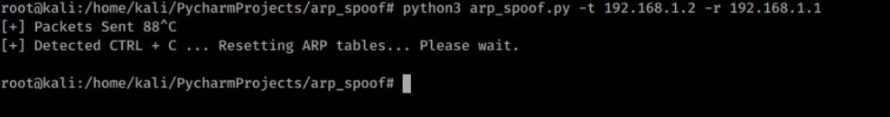

# ARP-SPOOFER

# WHAT IS ARP SPOOFER

==> Arp spoof tool allows us to attack ARP on devices in the network we are connected to.  
==> It sends ARP packets to the target device, making our computer look like a router.  
==> IT send ARP packages to the router and make our computer look like a target device.  
==> After this connection, you can listen and watch the target device.  

# USAGE

<ul>
  <li>
    python3 arp_spoof.py -t [ Target IP ] -r [ Router IP ]
  </li>
  <li>
    python3 arp_spoof.py --target [ Target IP ] --router [ Router IP ]
  </li>
</ul>
